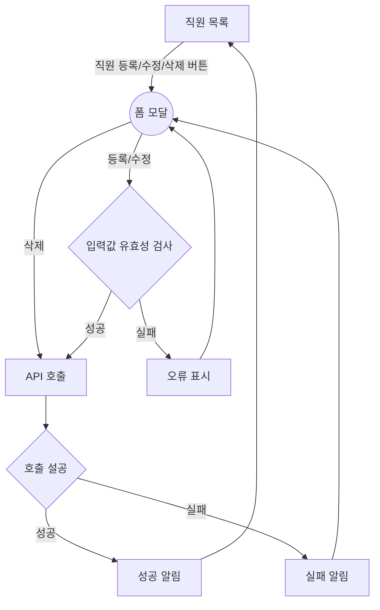
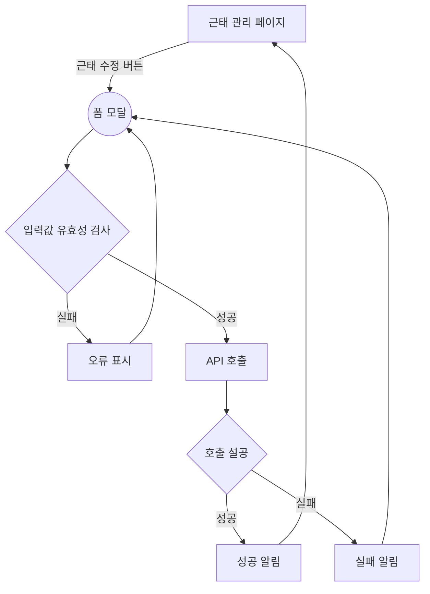
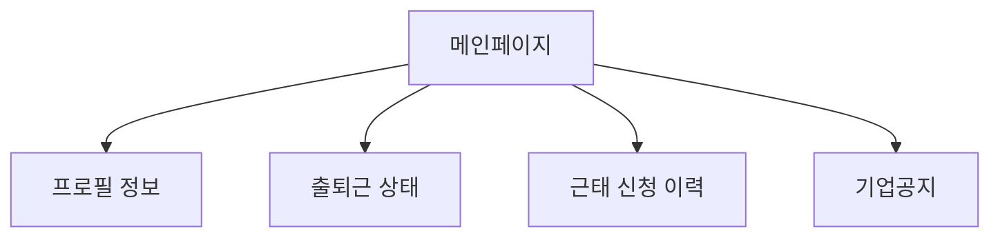
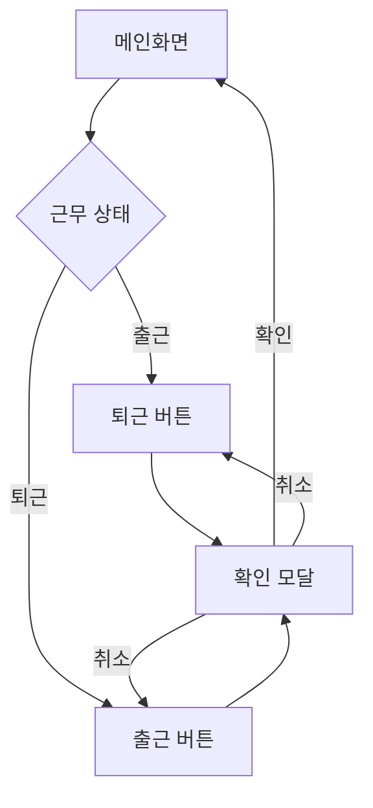
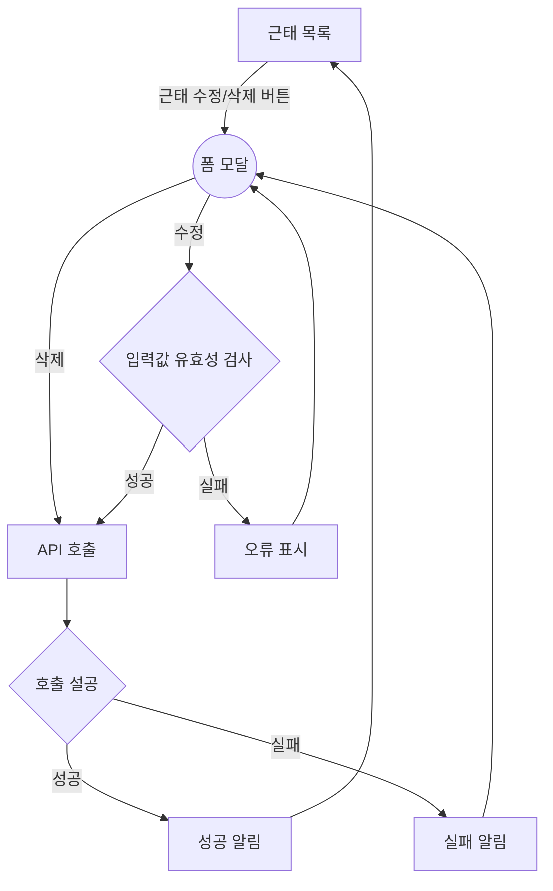

# 기능 정의서

[요구사항 정의서](요구사항정의서.md)의 기능들을 구체적으로 정의합니다.

## 1. 관리자 페이지

### 직원정보 등록 및 관리
- 기능 설명
  - 관리자 계정을 통해 새로운 사용자를 등록하고, 기존 사용자의 정보를 수정 및 삭제할 수 있습니다.
- 입력 항목
  - 추후 작성
  <!-- * 직원 ID: 고유 식별자 (자동 생성)
  * 이름: 문자열, 최대 50자
  * 주민등록번호: 문자열, 13자 (유효성 검사 필요)
  * 연락처: 문자열, 최대 15자 (유효성 검사 필요)
  * 이메일: 문자열, 최대 50자 (유효성 검사 필요)
  * 주소: 문자열, 최대 100자
  * 부서: 선택형 목록 (프론트엔드에서 제공)
  * 직급: 선택형 목록 (프론트엔드에서 제공)
  * 입사일: 날짜 (yyyy-mm-dd 형식) -->



---

### 출퇴근 기록 관리
- 기능 설명
  - 관리자 계정을 통해 직원들의 출퇴근 시간을 수정할 수 있습니다.
* 입력 항목
  - 추후 작성
  <!-- 버튼 클릭시 현재시간(클릭 액션으로 입력) YYYY-MM-DD hh-mm-ss (2024-06-08) -->
 - 직원정보 등록 및 관리와 로직 동일

---
### 근태 정보 관리
- 기능 설명
  - 관리자 계정을 통해 직원들의 근태를 수정할 수 있습니다.
- 입력 항목
  - 추후 작성


 

 ---
### 공지사항 관리
- 기능 설명
  - 관리자 계정을 통해 공지사항을 등록/수정/삭제할 수 있습니다.
- 입력 항목
  - 추후 작성
 - 직원정보 등록 및 관리와 로직 동일
 

 ## 2. 사용자 페이지
 ### 데시보드
- 기능 설명
  - 프로필, 출퇴근 정보, 근태 신청 이력, 공지 등을 한눈에 확인할 수 있습니다.


---
 ### 프로필 수정
- 기능 설명
  - 자신의 직원정보(이메일, 비밀번호, 이미지 등) 를 수정할 수 있습니다.
- 관리자 페이지의 직원정보 등록 및 관리와 로직 동일, 입력 항목만 상이
- 입력 항목
  - 추후 작성

---
### 출퇴근 시간 기록 및 조회
- 기능 설명
  - 출퇴근 시에 버튼을 눌러 출퇴근 처리하며, 현재 근무 현황을 조회할 수 있습니다.


---
### 근태 신청 및 내역 조회
- 기능 설명
  - 사용자는 근태를 신청할 수 있으며, 조회 및 수정 삭제도 가능합니다.
- 입력 항목
  - 추후 작성


## 3. 공통 기능
### 로그인
- 기능 설명
  - 로그인을 하여 관리자/직원 페이지에 각각 이동할 수 있습니다.
- 입력 항목
  - 추후 작성
  ```mermaid
  flowchart TD
    A[로그인 화면] --로그인 요청--> B{입력값 유효성 검사}
    B --성공--> C[로그인 API호출]
    B --실패--> D[오류 표시]-->A
    C --> E{호출 성공}
    E --성공--> F{관리자}
    F --YES--> H(관리자페이지)
    F --NO--> I(직원 데시보드)
    E -->|실패| G[로그인 실패 정보 표시]
    G ----> A
  ```